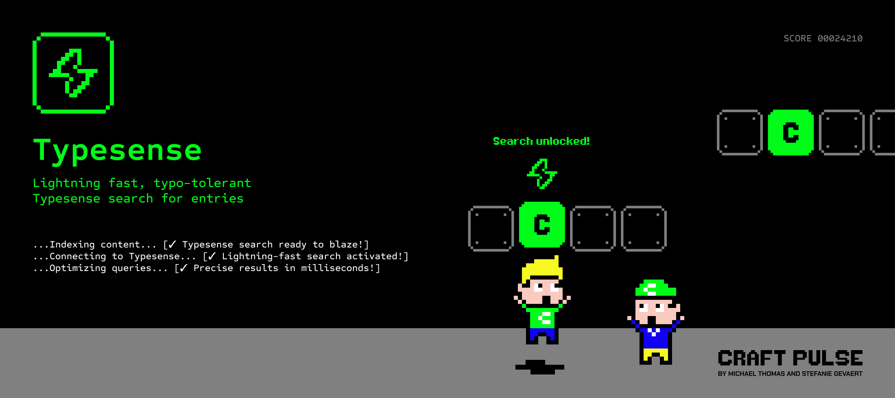

# Typesense for Craft CMS 5

Keep a [Typesense](https://typesense.org/) search index in lockstep with your
Craft content. Define collections with a fluent, type-safe config, and the plugin
syncs your elements, tunes relevance, and serves fail-soft searches to your front
end.



## Requirements

- Craft CMS 5.0.0 or later
- PHP 8.2 or later
- A Typesense server, version 28.0 or later

Server versions below 28.0 are unsupported. Versions 30.0 and 30.1 are refused
on purpose: their synonym and curation APIs return 404. Use 28.x, 29.x, or 30.2+.
The plugin detects the server version and enables version-specific features
automatically (see [Server versions and capabilities](docs/capabilities.md)).

## Free and Pro

The Free edition is a complete search engine: fluent config, the sync engine,
multi-site, synonyms/curation/presets from config, the search layer, a GraphQL
search query, scoped search keys, a read-only control-panel utility, drift
detection, and backup/restore.

The Pro edition adds control-panel authoring on top: a field-mapping UI, synonym
and curation managers, a relevance tuner, an analytics dashboard, and
vector/AI search. Lower editions never render Pro screens.

## Installation

```bash
composer require craftpulse/craft-typesense
php craft plugin/install typesense
```

Then add a Typesense admin API key (and, for the front end, a search-only key) in
Settings, Typesense.

## Quick start

Copy `vendor/craftpulse/craft-typesense/src/config.php` to `config/typesense.php`
and declare a collection:

```php
use craft\elements\Entry;
use craftpulse\typesense\builders\Collection;
use craftpulse\typesense\builders\Field;

return [
    'collections' => [
        Collection::make('products')
            ->elementType(Entry::class)
            ->elementQuery(fn($query) => $query->section('products'))
            ->fields(
                Field::string('title')->sort(),
                Field::string('body'),
                Field::float('price')->facet(),
            ),
    ],
];
```

Sync, then search:

```bash
php craft typesense/sync/all
```

```twig

{{ hit.document.title }}
```

For browser-side search, derive a [scoped search key](docs/scoped-keys.md) rather
than exposing any admin key.

## Documentation

Full docs live in [`docs/`](docs/):

- [Introduction](docs/introduction.md) and [Configuration](docs/configuration.md)
- [Fluent config reference](docs/fluent-config.md)
- [Sync engine](docs/sync-engine.md), [Documents](docs/documents.md), [Multi-site](docs/multisite.md)
- [Searching (+ GraphQL, stopwords, stemming)](docs/search.md)
- [Synonyms, curation and presets](docs/synonyms.md)
- [Scoped search keys](docs/scoped-keys.md)
- [Console commands](docs/console.md), [Control panel utility](docs/utility.md)
- [Drift detection](docs/drift.md), [Backup and restore](docs/backup.md)
- [Server versions and capabilities](docs/capabilities.md), [Settings](docs/settings.md)
- [Extending (for plugin authors)](docs/extending.md)
- [Upgrading to 5.9.0](docs/upgrading.md)

Pro control panel:

- [Collections cockpit](docs/pro-collections.md), [Field mapping](docs/mapping.md), [Search playground](docs/playground.md)
- [Curation](docs/pro-curation.md), [Synonyms and dictionaries](docs/pro-synonyms.md), [Indexing inspector](docs/inspector.md)
- [Relevance tuning](docs/pro-relevance.md), [Aliases and zero-downtime rebuilds](docs/pro-aliases.md)
- [API key management](docs/pro-keys.md), [A/B testing](docs/pro-ab-testing.md)
- [Analytics and ops](docs/pro-analytics.md), [Vector and AI](docs/pro-vector-ai.md)

## Upgrading from 5.8.x

This is a zero-touch update. Run `craft up` as usual; see
[docs/upgrading.md](docs/upgrading.md) for the details. If you run the Cockpit
companion plugin, update it to its 5.9.0 companion release as a paired run.

Brought to you by [CraftPulse](https://craft-pulse.com/)
