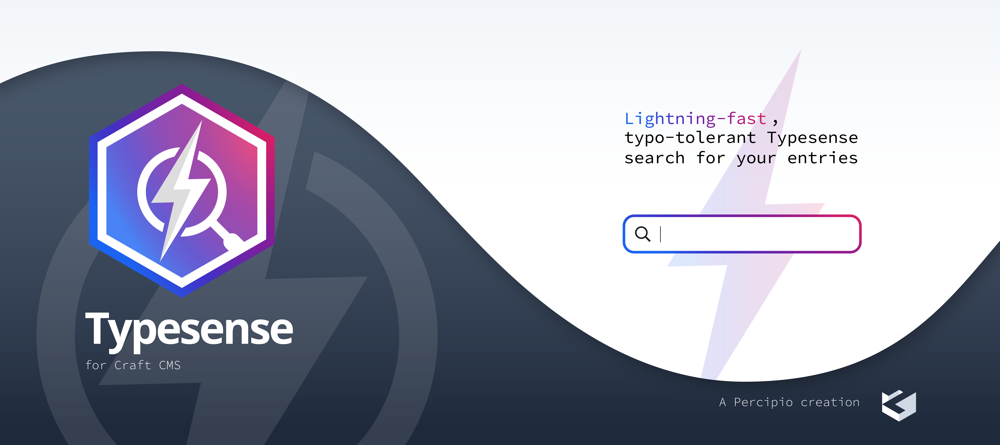

# Introduction

Craft Plugin that synchronises with Typesense.

## Requirements

This plugin requires Craft CMS 5.0.0 or later.

## Installation

To install the plugin, follow these instructions.

1. Open your terminal and go to your Craft project:

        cd /path/to/project

2. Then tell Composer to load the plugin:

        composer require craftpulse/craft-typesense

3. In the Control Panel, go to Settings, then Plugins, and click the "Install" button for Typesense.

## Typesense Overview

After setting up the config file with the indexes you want to create, syncing starts right away when you add, edit, or delete Craft CMS elements. To sync everything at once, go to the Collections screen within the Typesense section in the control panel and sync all of them.

Brought to you by [CraftPulse](https://craft-pulse.com).
