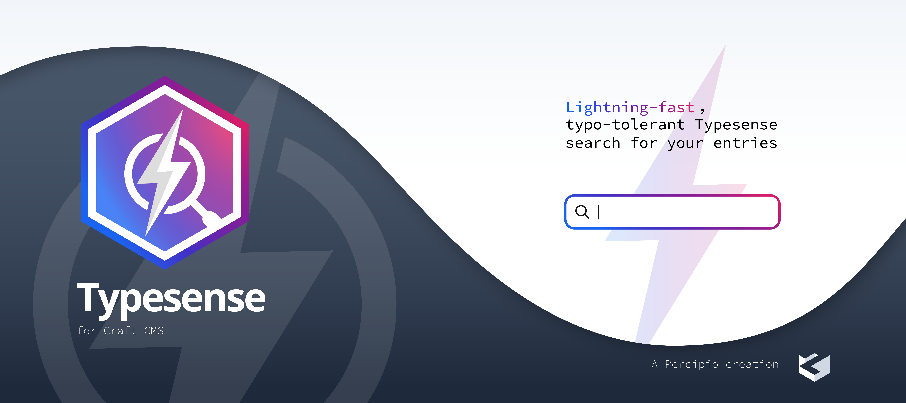

# Introduction

Craft Plugin that synchronises with Typesense

## Requirements

This plugin requires Craft CMS 4.0.0 or later.

## Installation

To install the plugin, follow these instructions.

1. Open your terminal and go to your Craft project:

        cd /path/to/project

2. Then tell Composer to load the plugin:

        composer require percipioglobal/typesense

3. In the Control Panel, go to Settings → Plugins and click the “Install” button for Typesense.

## Typesense Overview

After setting up the config file on which indexes you want to create, you start right away after add / edit / delete Craft CMS elements. If you want to sync all of them, you can go to the Collections within the Typesense section in the control panel and sync all of them.

Brought to you by [percipiolondon](https://percipio.london)
